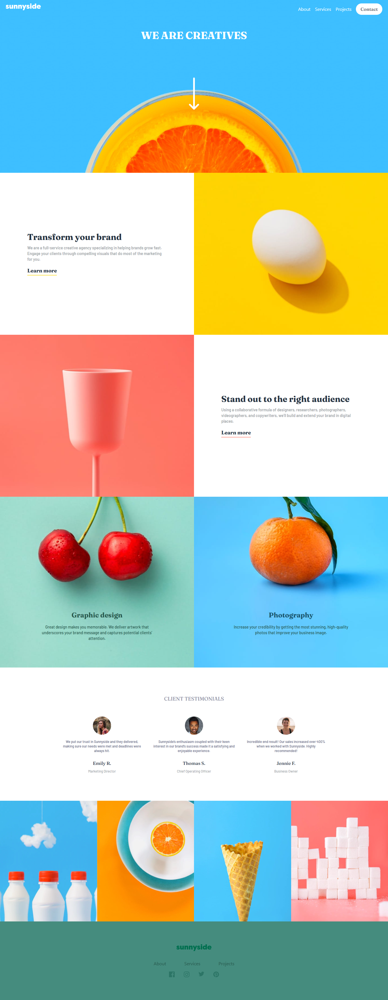

# Frontend Mentor - Sunnyside agency landing page solution

This is a solution to the [Sunnyside agency landing page challenge on Frontend Mentor](https://www.frontendmentor.io/challenges/sunnyside-agency-landing-page-7yVs3B6ef). Frontend Mentor challenges help you improve your coding skills by building realistic projects.

### Screenshot

### Links

- Solution URL:[solution](https://)
- Live Site URL:[Live Site](https://landingpage-one-rho.vercel.app/)

### Built with
- CSS
- Tailwind CSS
- [React](https://reactjs.org/) - JS library

